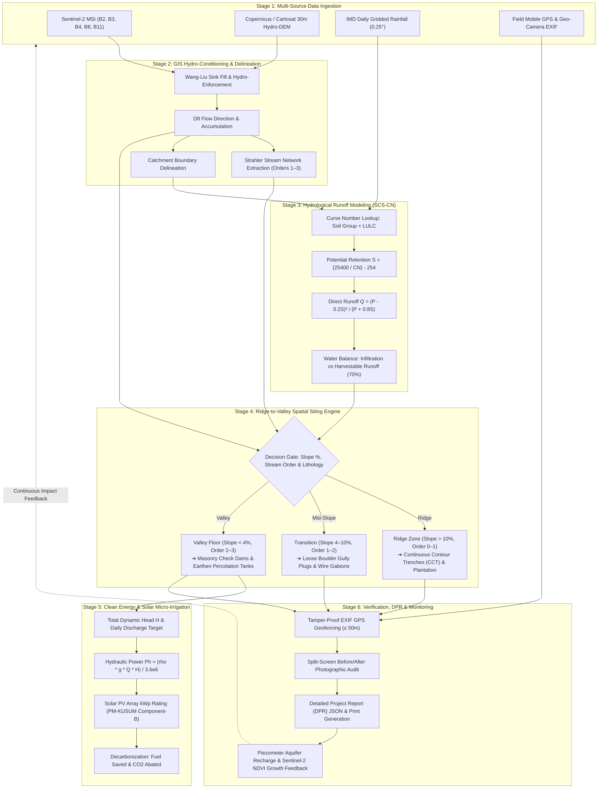

# System Requirements Specification (SRS)
## AQUANEXIS: GIS-Based Watershed Development Decision Support System

**Document Version:** 2.0  
**Project Classification:** National Geospatial Water Resource Engineering & Decision Support  
**Domain Standards:** WDC-PMKSY 2.0 (Pradhan Mantri Krishi Sinchayee Yojana), Bhuvan-ISRO Geospatial Guidelines, UN Sustainable Development Goal 6 (Clean Water and Sanitation).

---

## 1. Executive Summary & Vision

A watershed is an independent hydrological unit where all surface runoff drains through a common drainage network to a single outlet. Sustainable watershed management requires a **"Ridge-to-Valley"** approach: interventions must begin at upper ridges (to arrest runoff velocity, prevent soil erosion, and enhance recharge) and proceed downstream to the valley floor (for water harvesting, check dam construction, and percolation ponds).

**AQUANEXIS** is designed as a centralized, future-proof, GIS-enabled decision support platform that combines:
1. High-resolution satellite Earth observation data (multispectral indices like NDVI, NDWI, BSI).
2. Topographic & digital elevation model (DEM) hydrological flow routing.
3. Empirical hydrological runoff and soil loss modeling (SCS-CN and USLE equations).
4. Automated intervention siting algorithms (Continuous Contour Trenches, Gully Plugs, Gabions, Check Dams, Farm Ponds).
5. Clean energy and solar-powered micro-irrigation pumping feasibility.
6. Geo-tagged field photo auditing and community-driven outcome monitoring.

---

## 2. Stakeholder Profiles & Personas

| Role / Persona | Responsibilities & Needs | System Interaction |
| :--- | :--- | :--- |
| **Hydrologist / GIS Specialist** | Watershed boundary delineation, stream order classification (Strahler), slope and drainage density mapping. | GIS Layer Studio, remote sensing band processing, DEM flow accumulation modeling. |
| **Watershed Development Officer (WDO)** | Technical design, DPR (Detailed Project Report) preparation, structural intervention planning, budget allocation. | Intervention recommender, structural sizing calculations, DPR generation portal. |
| **Field Surveyor / Extension Worker** | Ground truthing, pre-work baseline surveys, periodic progress photography, geotagged evidence capture. | Mobile PWA / Field Geo-Camera module with GPS EXIF verification and offline caching. |
| **Village Watershed Committee (VWC)** | Transparent monitoring, community water budgeting, equitable irrigation access, maintenance scheduling. | Localized community dashboard, water deficit alerts, bilingual outcome metrics. |
| **Policy Makers & State Water Boards** | Macro-watershed outcome assessment, recharge trends, biomass recovery, carbon offset tracking. | Regional aggregation analytics, time-series vegetation/water index heatmaps. |

---

## 3. Functional Requirements (FR)

### FR-1: Geospatial Watershed Delineation & Topography Modeling
* **Inputs:** DEM (Digital Elevation Model at 12.5m - 30m resolution from Cartosat / Copernicus / SRTM).
* **Processing:**
  - Pit-filling (sink removal) using Wang and Liu algorithm.
  - D8 Flow Direction and Flow Accumulation matrix calculation.
  - Stream network extraction using threshold accumulation ($> 1000$ cells) and Strahler stream ordering (Order 1 through 4).
  - Slope category extraction: 0-3% (valley / plains), 3-8% (gentle slope), 8-15% (moderate slope), >15% (steep ridges).
* **Outputs:** GeoJSON micro-catchment boundary, drainage stream vectors, slope classification raster layer.

### FR-2: Satellite Earth Observation & Multispectral Indices
* **Inputs:** Sentinel-2 MSI / Landsat-8/9 Surface Reflectance bands:
  - Band 2 (Blue, ~490nm), Band 3 (Green, ~560nm), Band 4 (Red, ~665nm), Band 8 (NIR, ~842nm), Band 11 (SWIR-1, ~1610nm).
* **Calculations:**
  - **NDVI** (Normalized Difference Vegetation Index):
    $$\text{NDVI} = \frac{\text{NIR} - \text{Red}}{\text{NIR} + \text{Red}}$$
    *(Measures crop vigor, afforestation progress, biomass cover)*
  - **NDWI** (Normalized Difference Water Index / McFeeters):
    $$\text{NDWI} = \frac{\text{Green} - \text{NIR}}{\text{Green} + \text{NIR}}$$
    *(Delineates open surface water bodies, farm ponds, reservoirs)*
  - **MNDWI** (Modified NDWI / Xu):
    $$\text{MNDWI} = \frac{\text{Green} - \text{SWIR}}{\text{Green} + \text{SWIR}}$$
  - **BSI** (Bare Soil Index):
    $$\text{BSI} = \frac{(\text{SWIR} + \text{Red}) - (\text{NIR} + \text{Blue})}{(\text{SWIR} + \text{Red}) + (\text{NIR} + \text{Blue})}$$
    *(Identifies barren land vulnerable to topsoil erosion)*
* **Outputs:** Multi-temporal index maps, vegetation recovery trend curves, drought-stress hazard scores.

### FR-3: Hydrological Runoff & Water Balance Modeling (SCS-CN)
* **Methodology:** USDA Soil Conservation Service Curve Number (SCS-CN) method.
* **Governing Equations:**
  $$\text{Potential Maximum Retention } S = \frac{25400}{CN} - 254 \quad (\text{mm})$$
  $$\text{Initial Abstraction } I_a = 0.2 \times S$$
  $$\text{Direct Surface Runoff } Q = \begin{cases} \frac{(P - I_a)^2}{P - I_a + S} & \text{for } P > I_a \\ 0 & \text{for } P \le I_a \end{cases}$$
  $$\text{Runoff Volume } V_r = Q \times A \times 10 \quad (\text{m}^3) \quad [\text{where } A \text{ is area in ha}]$$
* **Inputs:** 24-hour storm rainfall ($P$ in mm), Hydrologic Soil Group (HSG A, B, C, D), Land Use / Land Cover (LULC), Antecedent Moisture Condition (AMC-I dry, AMC-II normal, AMC-III wet).
* **Outputs:** Direct runoff volume, soil infiltration capacity, net harvestable rainwater surplus/deficit.

### FR-4: Soil Erosion Hazard Estimation (USLE / RUSLE)
* **Formula:**
  $$A_{\text{loss}} = R \times K \times LS \times C \times P_{\text{conservation}}$$
  - $R$: Rainfall-runoff erosivity factor (MJ·mm/(ha·h·yr))
  - $K$: Soil erodibility factor (t·ha·h/(ha·MJ·mm))
  - $LS$: Topographic slope length and steepness factor
  - $C$: Cover management factor (derived from NDVI)
  - $P_{\text{conservation}}$: Support conservation practice factor
* **Outputs:** Annual soil loss in tonnes/ha/year, priority zoning (Slight: <5 t/ha, Moderate: 5-15 t/ha, High: 15-40 t/ha, Very Severe: >40 t/ha).

### FR-5: Ridge-to-Valley Interventions Decision Engine
* **Rule-Based Decision Matrix:**
  1. **Ridge Zone (Slope > 10%, Stream Order 0-1):**
     - Continuous Contour Trenches (CCT), Staggered Contour Trenches (SCT), Vegetative vegetative bunds.
     - Spacing formula: $V.I. = \left(\frac{S}{3} + 2\right) \times 0.3$ meters.
  2. **Transition / Upper Valley Zone (Slope 4-10%, Stream Order 1-2):**
     - Loose Boulder Structures (LBS) / Gully Plugs, Gabion check dams, vegetative filter strips.
     - Purpose: Energy dissipation, sediment trapping, preventing gully widening.
  3. **Valley Floor (Slope < 4%, Stream Order 2-4, Permeable Alluvial/Weathered Strata):**
     - Masonry Check Dams, Earthen Nala Bunds, Percolation Tanks, Community Farm Ponds.
     - Storage capacity sizing based on 75% dependable rainfall runoff yield.
* **Outputs:** Georeferenced intervention coordinates, structure bills of quantities (BoQ), expected groundwater recharge yield ($m^3$), cost estimate.

### FR-6: Clean Energy & Solar-Powered Lift Sizing
* **Governing Equations:**
  $$\text{Hydraulic Power } P_h = \frac{\rho \cdot g \cdot Q_d \cdot H_{\text{total}}}{3.6 \times 10^6} \quad (\text{kW})$$
  $$\text{Pump Motor Input Power } P_{\text{in}} = \frac{P_h}{\eta_{\text{pump}} \times \eta_{\text{motor}}}$$
  $$\text{Solar PV Array Capacity } P_{\text{pv}} = \frac{P_{\text{in}} \times f_{\text{mismatch}}}{\text{Peak Sun Hours (PSH)}} \quad (\text{kWp})$$
* **Emissions Offsetting:**
  $$\text{Diesel Consumed Saved} \approx 0.32 \text{ liters/kWh}$$
  $$\text{CO}_2 \text{ Avoided} \approx 2.68 \text{ kg CO}_2 \text{ per liter diesel}$$
* **Outputs:** Solar PV array rating in kWp, total dynamic head ($H_{\text{total}}$), daily discharge capacity ($m^3$/day), lifetime diesel savings, CO2 abatement metrics.

### FR-7: Field Verification & Geo-Camera Telemetry
* **Capabilities:**
  - EXIF metadata extraction: Latitude, Longitude, Heading/Compass Bearing, Altitude, UTC Timestamp.
  - Geo-fencing validation: Cross-checks if uploaded photo was taken within $\le 50\text{m}$ of proposed structure site.
  - Pre-work, During-work, and Post-work stage documentation.
  - Interactive split-view comparison slider for public auditing.

### FR-8: Outcome Monitoring, Impact KPI & Water Budget Reporting
* **Indicators Tracked:**
  - Groundwater table elevation rise (meters below ground level - mbgl).
  - Additional irrigation potential created (AIPC in hectares).
  - Crop diversification index (Single crop $\to$ Double/Cash crop transition).
  - Surface water bodies area expansion ($m^2$).
  - Generation of complete Detailed Project Report (DPR) exportable in PDF, CSV, and GeoJSON.

---

## 4. Non-Functional Requirements (NFR)

| ID | Category | Specification |
| :--- | :--- | :--- |
| **NFR-1** | **Performance & Latency** | Map pan/zoom responsiveness $\le 16\text{ms}$ (60 fps). Runoff calculations computed in $< 50\text{ms}$ on client side. Initial page load $< 1.5\text{s}$. |
| **NFR-2** | **Geospatial Standards** | Adherence to Open Geospatial Consortium (OGC) specifications: GeoJSON (RFC 7946), WGS84 (EPSG:4326), Web Mercator (EPSG:3857). Support for Tile Map Service (TMS/XYZ). |
| **NFR-3** | **Offline-First Field Capability** | Service worker caching of base tiles and vector layers so field officers can log coordinates, photos, and inspection notes in low/no-connectivity rural regions. |
| **NFR-4** | **Security & Integrity** | Tamper-proof EXIF validation, prevention of spoofed GPS coordinates, role-based access control (RBAC) separating administrative approvers from field survey agents. |
| **NFR-5** | **Scalability** | Cloud-native microservices architecture; stateless vector tiling; scalable object storage (S3/GCS) for multispectral GeoTIFFs and field imagery. |
| **NFR-6** | **Usability & Aesthetics** | Dark/light high-contrast environmental design, accessible WCAG 2.1 AA compliant color schemes, clean micro-interactions, responsive across desktop, tablet, and mobile screens. |
| **NFR-7** | **Bilingual & Localization** | Translatable UI strings to support national and regional languages (English, Hindi, regional Indian languages) for community watershed committees. |
| **NFR-8** | **Interoperability** | RESTful JSON APIs to synchronize with government portals (e.g. WDC-PMKSY MIS, Bhuvan GIS, Jal Jeevan Mission API, Central Ground Water Board - CGWB). |

---

## 5. End-to-End System Pipeline & Decision Flowchart



### Data Schema Formats

#### A. Micro-Watershed GeoJSON Feature Schema
```json
{
  "type": "Feature",
  "id": "WS-KA-DVG-0104",
  "geometry": {
    "type": "Polygon",
    "coordinates": [[[76.012, 11.045], [76.035, 11.062], [76.058, 11.041], [76.029, 11.021], [76.012, 11.045]]]
  },
  "properties": {
    "watershed_name": "Kalleshwara Micro-Watershed",
    "total_area_ha": 482.5,
    "mean_elevation_m": 412.0,
    "average_slope_pct": 5.8,
    "predominant_soil_group": "B",
    "annual_rainfall_mm": 845.0,
    "stream_order_max": 3,
    "composite_curve_number": 74,
    "annual_runoff_potential_cum": 841200,
    "current_recharge_deficit_cum": 312000,
    "status": "High Priority"
  }
}
```

#### B. Intervention Structural Specification Schema
```json
{
  "intervention_id": "INT-CD-042",
  "watershed_id": "WS-KA-DVG-0104",
  "structure_type": "Masonry Check Dam",
  "topographic_zone": "Valley Floor",
  "stream_order": 3,
  "coordinates": { "latitude": 11.0345, "longitude": 76.0412 },
  "catchment_area_ha": 86.4,
  "storage_capacity_cum": 4500,
  "annual_recharge_capacity_cum": 13500,
  "estimated_cost_inr": 385000,
  "material_spec": "Random Rubble Stone Masonry in 1:4 Cement Mortar with Apron",
  "stage": "Proposed",
  "pre_work_image_url": "storage/images/INT-CD-042_pre.jpg",
  "post_work_image_url": "storage/images/INT-CD-042_post.jpg"
}
```

---

## 6. Future Technology Roadmap

```
Phase 1 (Current Delivery)
├── Interactive GIS Web Studio with Leaflet & Esri Layers
├── Hydrological SCS-CN & Ridge-to-Valley Siting Engine
├── Solar Clean Energy Sizing & Field Geo-Camera Module
└── Standard DPR Export (GeoJSON, CSV, Printable Report)

Phase 2 (Near-Term: 6 Months)
├── Automated Check-Dam Siting via Deep Learning (UNet on High-Res DEM)
├── Live Copernicus Sentinel-2 STAC API ingestion with automated cloud-masking
└── Mobile Offline PWA with IndexedDB vector caching & Background Geolocation

Phase 3 (Medium-Term: 12-18 Months)
├── Edge AI on Mobile Cameras: Real-time Gully Depth & Siltation Measurement
├── IoT Telemetry Integration: Solar-powered Piezometer Ground Water Sensors
└── Sub-surface Hydrological Modeling via MODFLOW / SWAT cloud pipelines

Phase 4 (Long-Term: 24+ Months)
├── River Basin Digital Twin with Real-time 3D Terrain Simulation
└── Micro-Watershed Carbon Credit & Water Ledger on Verifiable Decentralized Registry
```

### 1. Edge AI Gully Erosion & Sedimentation Detection
Deploy lightweight TensorFlow Lite / ONNX computer vision models directly within the mobile field app. Field surveyors point the device camera at gullies or check dam silt basins; the neural network computes depth, cross-sectional area, and sediment silt volume using monocular depth estimation without requiring LiDAR equipment.

### 2. Deep Learning Automated Intervention Siting
Train a convolutional UNet model on 10,000+ validated PMKSY successful check dams and contour trenches. Given DEM slope, flow accumulation, lithology, and drainage density rasters, the model outputs a probability heatmap indicating the exact geocoordinates of optimal barrier placements with $> 92\%$ hydrologist concurrence.

### 3. IoT Piezometric Ground Water Monitoring Network
Incorporate low-power LoRaWAN / NB-IoT solar-powered depth sensors into observation borewells across the watershed. Continuous groundwater elevation telemetry provides real-time verification of aquifer recharge rates following monsoon rainfall events.

### 4. Basin Digital Twin & Water Budget Credits
Create a web-based 3D digital twin of the basin where villagers and policy makers simulate future rainfall scenarios, drought years, or crop pattern changes, calculating exact water security reserves and issuing verified water stewardship credits for sustainable conservation.

---

## 7. Compliance & Standards Checklist

- [x] **WDC-PMKSY 2.0 Guidelines:** Conforms to prescribed ridge-to-valley spatial planning sequence.
- [x] **Central Ground Water Board (CGWB):** Compatible with master plan methodology for artificial aquifer recharge.
- [x] **OGC Standards:** Fully compliant with GeoJSON, EPSG:4326, EPSG:3857, and WMS/WFS protocols.
- [x] **Government Open Data (data.gov.in):** Interoperable with IMD gridded datasets and ISRO Bhuvan geospatial schemas.
- [x] **Clean Energy Integration:** MNRE (Ministry of New and Renewable Energy) standards for PM-KUSUM solar water pumping.
